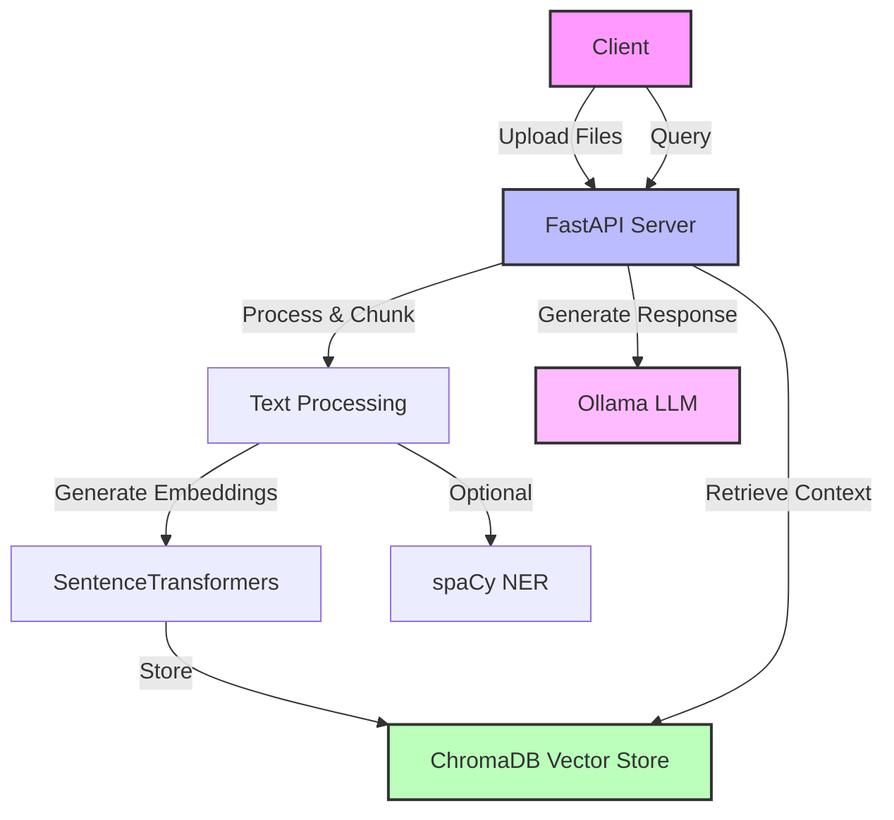

# RAG FastAPI - Intelligent Document Query System

[](https://www.python.org/)
[](https://fastapi.tiangolo.com/)
[](LICENSE)
[](https://www.trychroma.com/)
[](https://ollama.ai/)

A production-ready Retrieval-Augmented Generation (RAG) system built with FastAPI, ChromaDB, and Ollama. This system enables intelligent document querying by combining semantic search with large language model capabilities.

## 🌟 Features

- **📄 Multi-format Document Ingestion**: Support for PDF and text file uploads
- **🔍 Semantic Search**: Advanced vector-based document retrieval using ChromaDB
- **🤖 LLM Integration**: Powered by Ollama for intelligent response generation
- **🔐 Privacy-First**: Built-in anonymization for sensitive data (PII, emails, phone numbers)
- **⚡ High Performance**: Optimized with caching and efficient text chunking
- **📊 Metadata Filtering**: Query documents by source, page numbers, and custom filters
- **🔄 RESTful API**: Clean, well-documented API endpoints
- **📝 Comprehensive Logging**: Built-in logging for debugging and monitoring

## 🏗️ Architecture

The system follows a modular Retrieval-Augmented Generation (RAG) pipeline built around FastAPI, ChromaDB, and Ollama.


## 📋 Prerequisites

- ** Python 3.8 or higher
- ** Ollama API access (for LLM inference)
- ** 4GB+ RAM recommended
- ** Optional: CUDA-capable GPU for faster embeddings

## 🚀 Quick Start

- **1-Clone the Repository**
```bash
git clone https://github.com/yourusername/rag-fastapi.git
cd rag-fastapi
```

- **2-Install Dependencies**
```bash
pip install -r requirements.txt
```

- **2-Set Up Environment Variables**
  Create a .env file in the project root:
```bash
OLLAMA_API_KEY=your_ollama_api_key_here
OLLAMA_MODEL="deepseek-v3.1:671b-cloud"  #for exmaple
```


